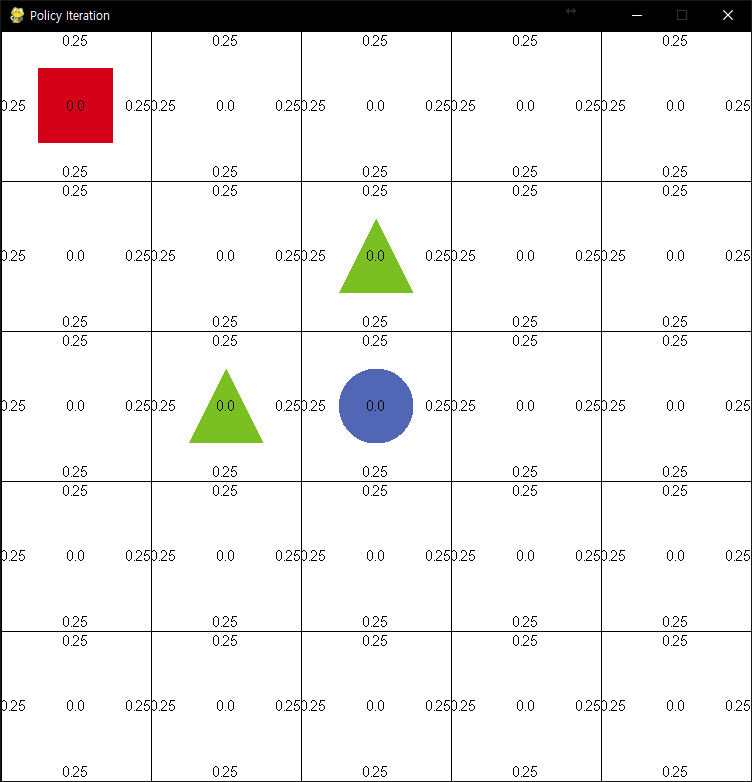

# 정책 이터레이션(Policy Iteration)

블로그를 통해 [간단한 이론](http://cineraria219.tistory.com/51)을 볼 수 있습니다.

### Key 설명
* e : 정책 평가(policy evaluation)
* i : 정책 발전(policy improvement)
* m : 한 칸씩 움직이기(move)
* r : 초기화(reset)

### 간단한 설명
각 칸의 5개 데이터를 볼 수 있는데 중앙은 가치 함수(value function), 각 4 방향 값들은 정책(Policy)의 값이다. 
* 사각형 : 에이전트
* 삼각형 : 장애물
* 원 :  목표지점

evaluation(e)과 improvement(i)을 한 번씩 번갈아 하다보면 최적 정책과 가치함수를 볼 수 있습니다.

### 실행 시 화면

* 초기화면

* 최적 정책, 가치함수

